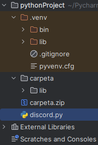
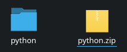
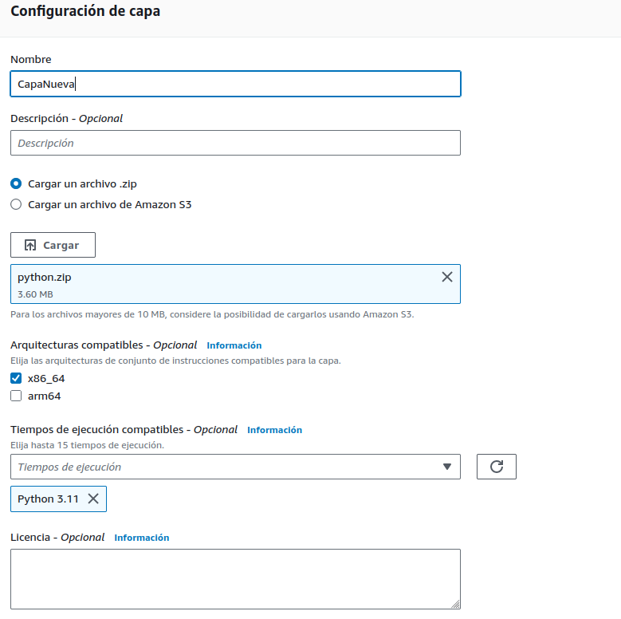

# El primer paso es copiar todo el contenido encontrado en "lib" dentro de otra carpeta de nuestra elección

# Ahora se comprime la carpeta en la que se copió el directorio "lib", es obligatorio que esta carpeta se llame "python". El comprimido es un .zip

# En AWS se crea una nueva función y en este se coloca el código que nos interesa lanzar

# Luego se crea una capa nueva, en la que se coloca el .zip y la versión del código

# Finalmente se añade a la función la capa creada

# Se comprueba su funcionamiento realizando un test de la función

